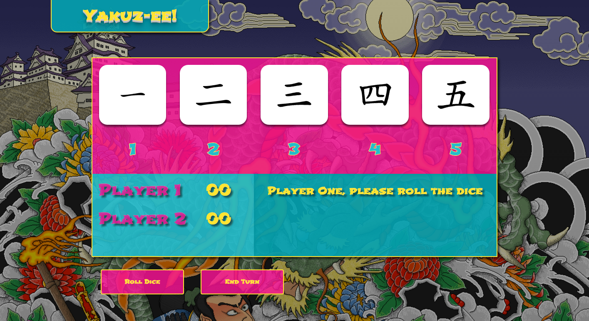

# Yakuz-ee!

### Welcome to **Yakuz-ee!**

A Japanese themed Yahtzee style game.

> Yakuz-ee was developed using the following and can be ran on any browser:
* HTML
* CSS/Sass
* JavaScript/jQuery
* Bootstrap

Yahtzee is a dice game where you roll five dice and try to get specific combinations for points. Yakuz-ee is a variation on Yahtzee that shares many similarities. In Yakuz-ee, there are five rounds. Each player gets three rolls per round. The objective is to roll and select dice to get the best combination of dice that provides the most points.

* A Yakuz-ee is five of any number: **100 pts!**
* A fullhouse is three of a kind and two of a kind: **50 pts**
* A straight is one of each die: **40 pts**
* Four of a kind: **30 pts**
* Three of a kind: **20 pts**
* A pair: **10 pts**

When time permits, I would like to add additional features and animations to enhance the game experience. Such as, allowing players to enter their own names, adding a score key, and using a library like Velocity to animate and spin the dice.

[Link to the site](jeffsteed.github.io/project1)
